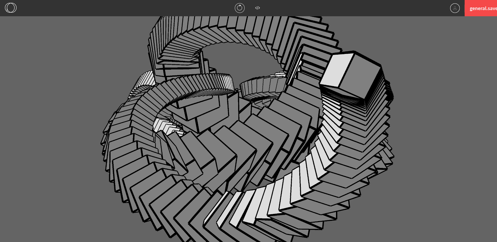
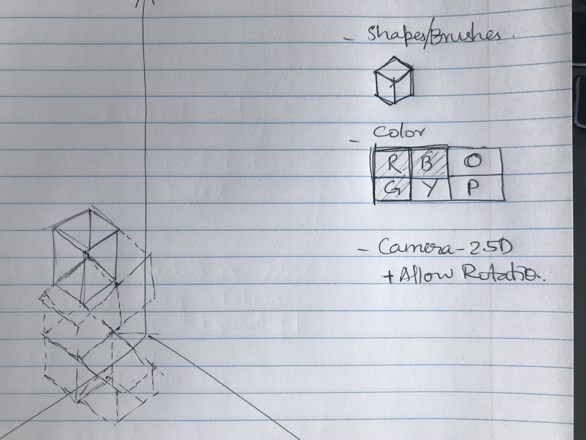

# Documenting Progress of the Project

## Initial Idea: Building a Free-hand 3D Painting Tool
The idea was to build a 3D free-hand painting tool, that allows paiting in all three dimensions. But the challenges of this was two fold - building a brush that can represent a paint brush in 3D and interactivity in 3D - using mouse and keyboard.
Solution - To add constraints in terms of brush - Box/Lines and interactivity - to paint in 2D while having a rotation on the third axis.

Initial Free-hand solution - 

## Idea Pivot: Building a Isometric Painting Tool
Thinking about the adding constraints to the tool led me to think along the 2.5D direction of isometric projections - this removes the 6 Degree of Freedom in 3D to just 3 degrees of freedom. This also allows me to build a simple cube/voxel brush and allows painting in this constrained dimensions.

New Idea -

Inspiration - Minecraft - Lego - Tetris

### Update1: Challenges
Understanding the coordinate system of WebGL and understanding Isometric projection and getting it to align with mouse interactions(orbitControl())

