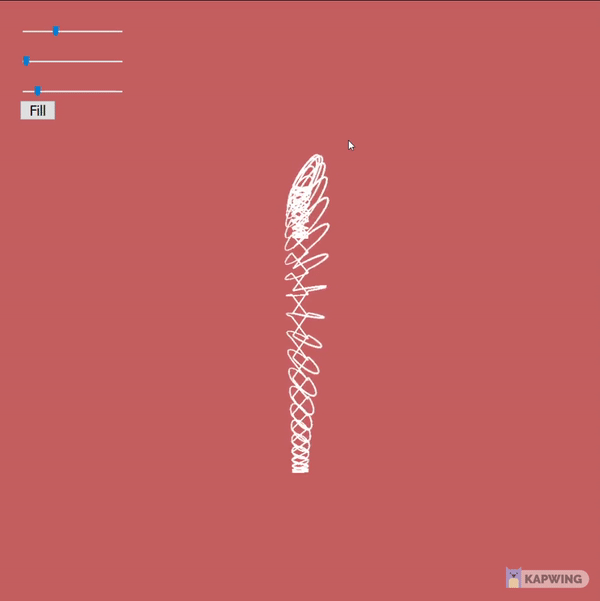
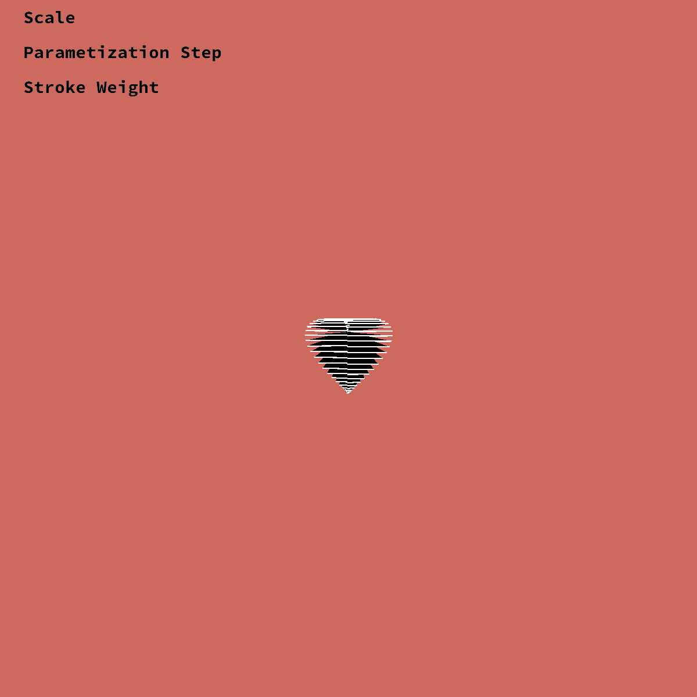
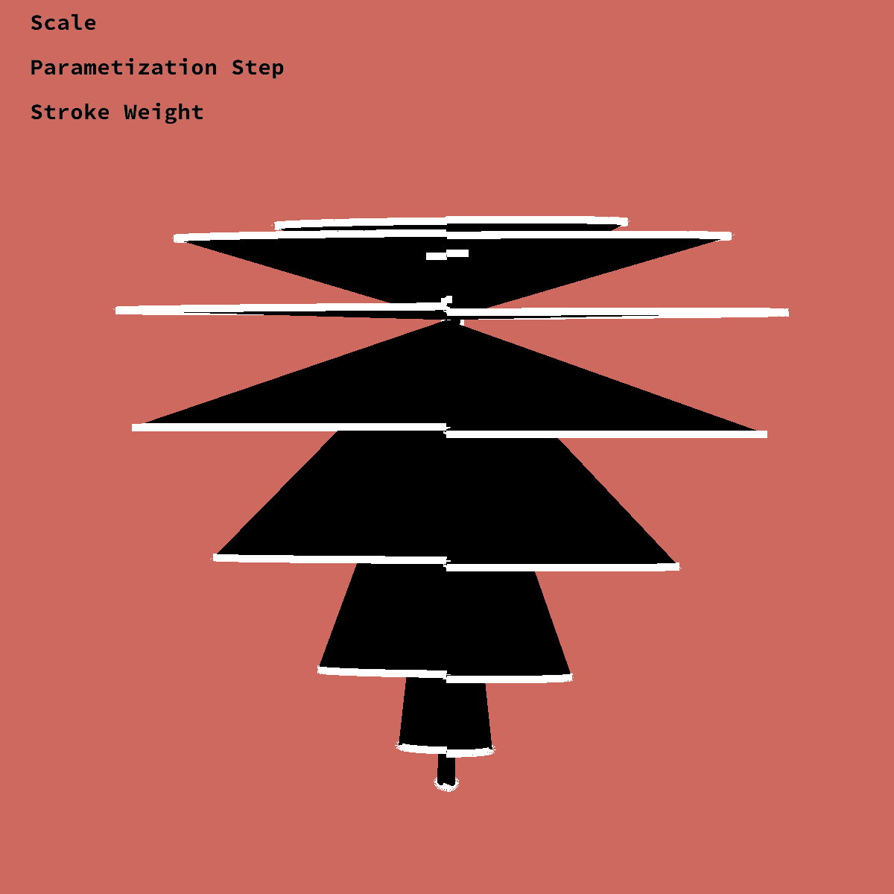
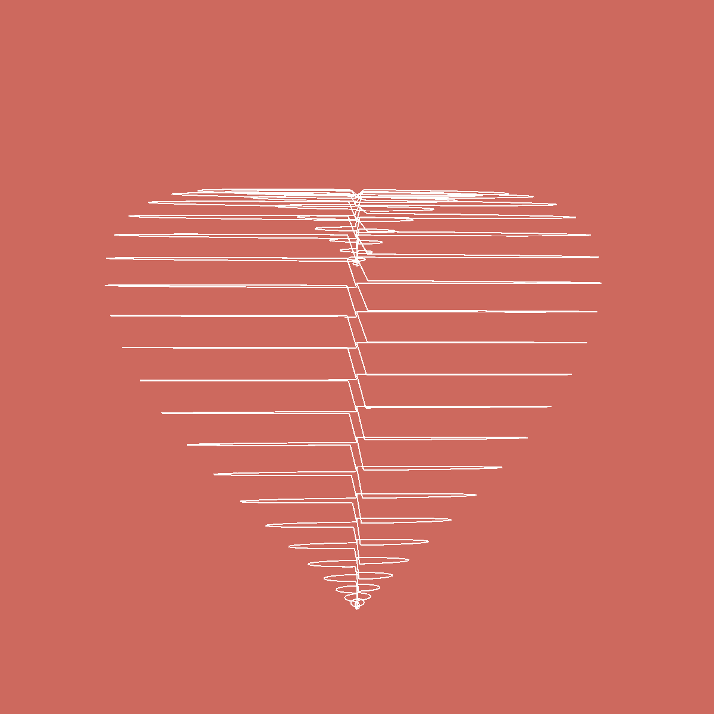

# I (x^2 + 9/4y^2 + z^2 - 1)^3 -x^2z^3 - 9/200y^2z^3 you.

## Idea Description
I initially wanted to try parametrized shapes, based on number of sides to have 2D and 3D shapes. I then extended the idea to one of 3D parameterized shapes and decided to choose the heart, I also played with Trefoil knot, but the aesthetics of the heart were more appealing to me.

You can try it out at - [https://editor.p5js.org/surya.dakshina/sketches/Kkiq804pk](https://editor.p5js.org/surya.dakshina/sketches/Kkiq804pk)

TODO: There is a bug with text color so the Fill option will sometimes disable the fill for the text. The parameters are - Scale, Parameter Step and Stroke Weight + Button to add/remove Fill.

## Parameter Constraints and DOF

The constraints I chose were so that I could maintain the shape of the heart - so I didn't modify the cartesian conversion in terms of the sine and cosine factors. The degrees of freedome were along the scale of the model, the U parameter of the polar to cartesian step, Stroke Weight of the heart and a fill button to add and remove fill. This allowed for some really abstract to diverse appearance when combined in uniques variations.

## Sample Images

  
