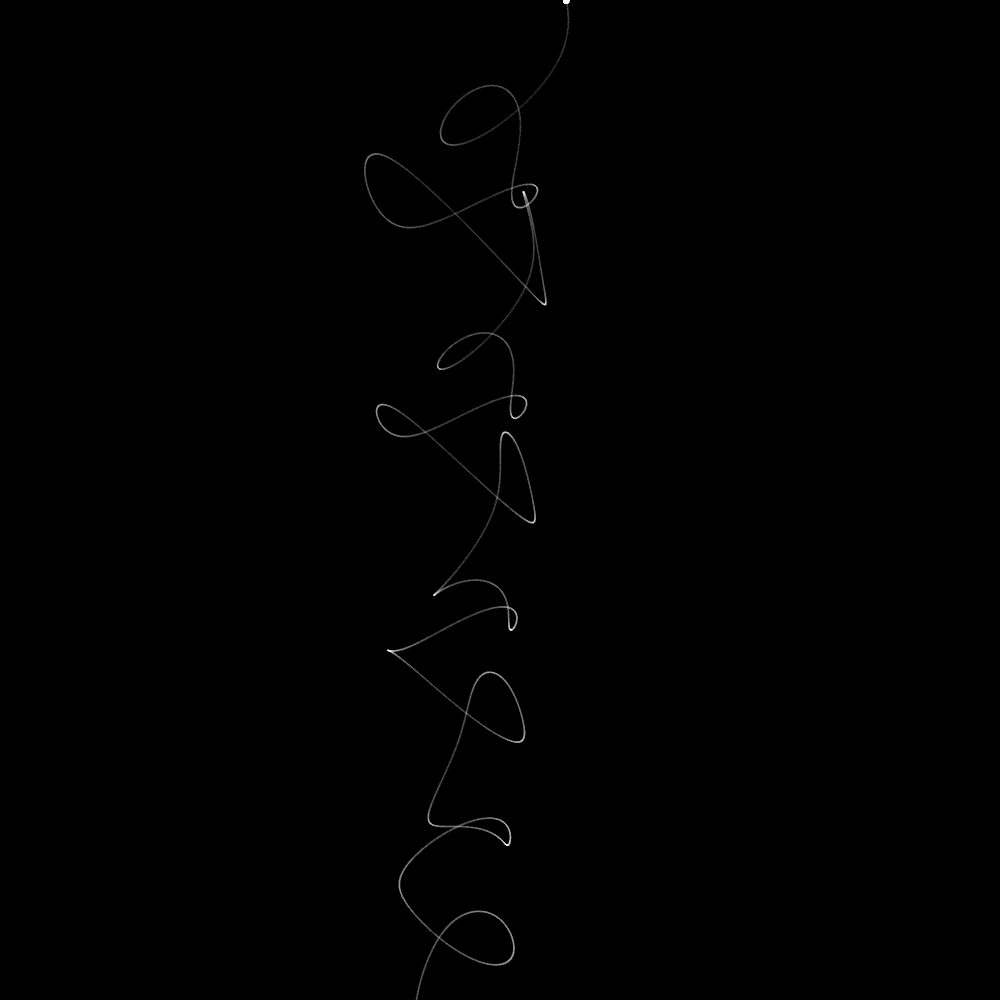
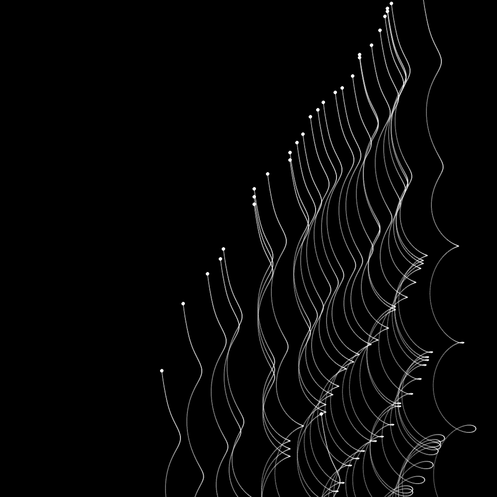
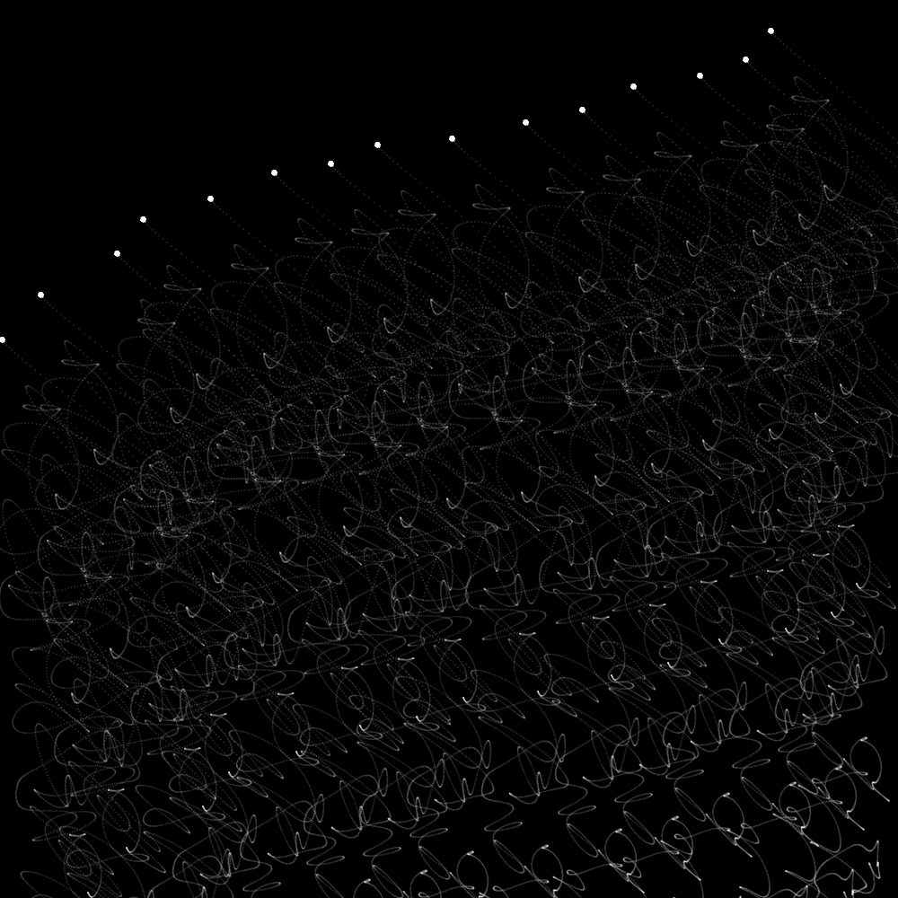

# The Pensieve from Harry Potter

The inspiration for this project was from the Harry Potter series, where they have a pensieve which can collect memories in a liquid bowl and visualize them. Something like this - 

To bring this idea to life, I experimented with fluids(WEBGL), smoke particle systems(Daniel Shiffman) and ink replication(in p5.js) - most of which were computationally very expensive [here](https://editor.p5js.org/surya.dakshina/sketches/tedP4Rfh5). The best work of this was when I used mouse click for randomn particle creation and tracked particle trajectory using [simplex noise](https://en.wikipedia.org/wiki/Simplex_noise), which is is a more intuitive noise for simulating fluids - liquids and smoke and I tried to simulate ink droplets on a black liquid background.

Parameters incorporated - 

`Motion Radius` - Lerp radius between two particles  
`M` - No. of points between the two particles  
`Delay Factor` - Delay in animating the two particles  
`Number of Frames` - the time interval between drawing particles

TODO: extend it to 3D and improve optimization

### Screenshots - 

Parameterized Simplex Ink Drops -

  

References - 
[Etienne Jacob](https://necessary-disorder.tumblr.com/)  
[Coding Train Fluids](https://thecodingtrain.com/CodingChallenges/132-fluid-simulation.html)  
[Coding Train Perlin Noise](https://thecodingtrain.com/CodingChallenges/024-perlinnoiseflowfield.html)
