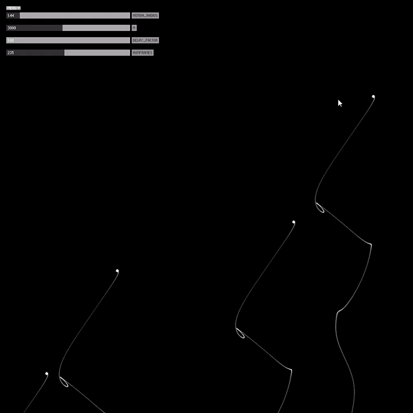

# The Pensieve from Harry Potter

The inspiration for this project was from the Harry Potter series, where they have a pensieve which can collect memories in a liquid bowl and visualize them. Something like this - 

To bring this idea to life, I experimented with fluids(WEBGL), smoke particle systems(Daniel Shiffman) and ink replication(in p5.js) - most of which were computationally very expensive. The best work of this was when I used mouse click for randomn particle creation and tracked particle trajectory using [simplex noise](https://en.wikipedia.org/wiki/Simplex_noise), which is is a more intuitive noise for simulating fluids - liquids and smoke and I tried to simulate ink droplets on a black liquid background.

TODO: extend it to 3D and improve optimization

### Screenshots - 

Parameterized Simplex Ink Drops -

Reference - [Etienne Jacob](https://necessary-disorder.tumblr.com/)
