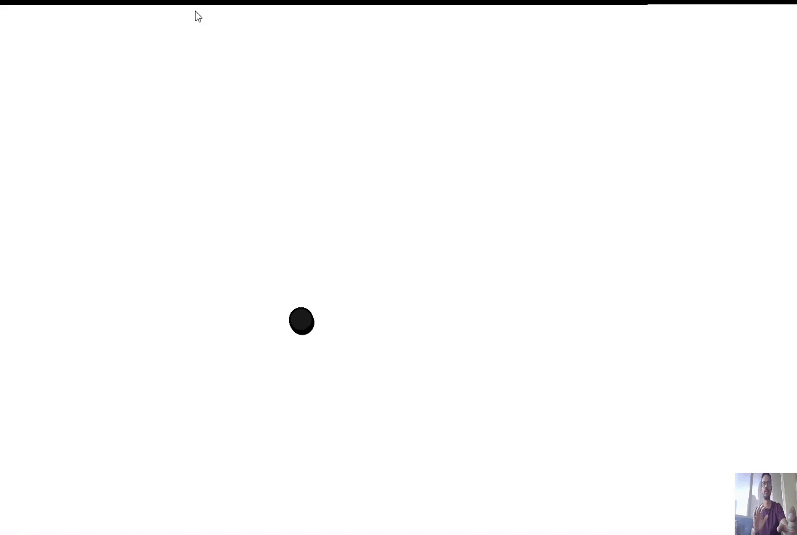
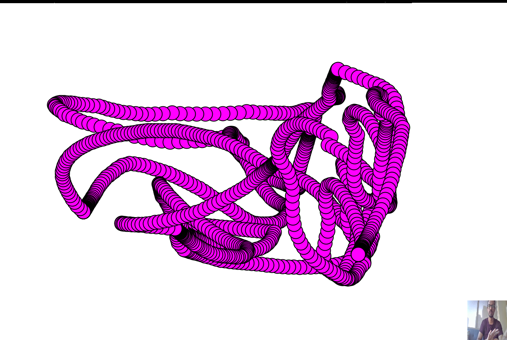
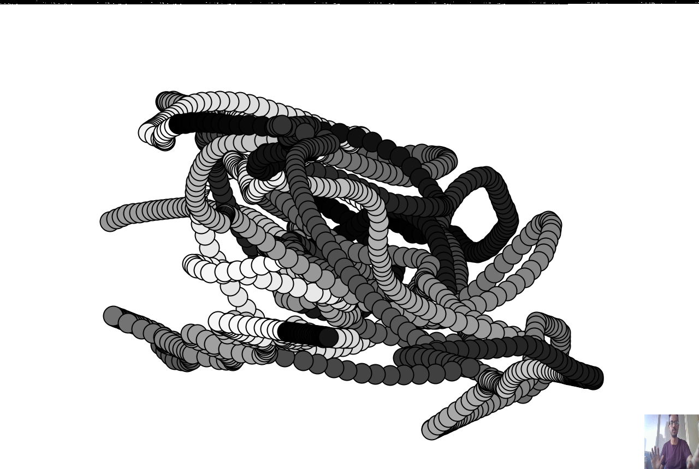
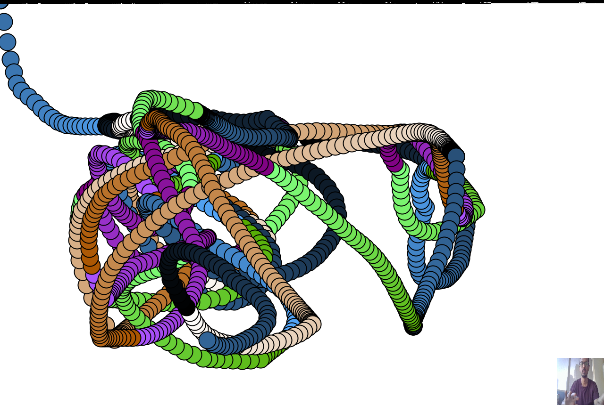

# Air Brush

This week was an experimentation with camera as a source of - geesture input for drawing and obtrusion for drawing. I experimented with p5.js for using camera motion as a glitch in the painting, which can be experiemented here - [https://editor.p5js.org/surya.dakshina/sketches/lntcEVttb](https://editor.p5js.org/surya.dakshina/sketches/lntcEVttb). But working further along, I wanted to play with the idea of using motion detection as a simple 2D gesture tracking and to use it for augmenting sketches. The idea is that any motion on the camera averages a position for cursor and is used as an input for drawing the sketches. Challenges for the sketches - 
1. Input Precision - Since the input doesn't use any 3D sensor or depth sensor, but a image space averaging to get the cursor location, the ability to get accurate sketch points is greatly hindered.  
2. Lateral Inversion - You need to move along your right hand to draw on the left of the canvas and vice-versa, which adds another challenge to the ability to draw what's on your mind. (thanks to the inversion in OpenCV, though it is just a matter or lateral inversion)

## Sketches -

## References -
[Daniel Shiffman](https://youtu.be/QLHMtE5XsMs)
