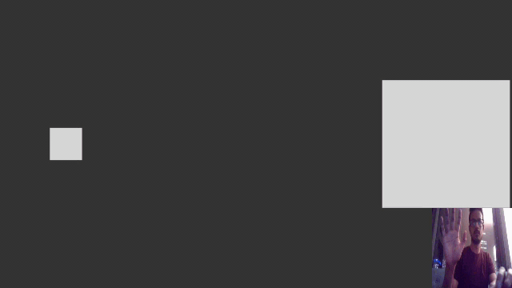

# Motion Based Gesture Control Library for Processing

The library source can be found here - https://github.com/codesavory/MotionDetection-GestureLibrary-Processing  
Pre-requisite - [Video Library](https://processing.org/reference/libraries/video/index.html) from Processing Foundation

The library was built to easily use motion based gesture control as input similar to mouse, with examples of drawing and 2D object control showing it's feasability. This library was based on manual background subtraction from video frames - BkgdSubtraction.java, this can be expanded to other motion detection algorithms as part of Video library - Background Subtraction by Golan Levin and OpenCV library - Optical Flow.

#### API -  
`BkgdSubtraction::getValues(video)` - This updates the class variables for the current input video frame  
`BkgdSubtraction::pgestX` - Access class varible that holds previous X position  
`BkgdSubtraction::pgestY` - Access class varible that holds previous Y position  
`BkgdSubtraction::gestX` - Access class varible that holds current X position  
`BkgdSubtraction::gestY` -  Access class varible that holds current Y position  

#### Terminology - 
**Package** - *motiondetection.gesture* - This is a package to include all motion detection algorithms for gesture 
**Class** - *BkgdSubtraction* - The current algorithm is a manual background subtraction algorithm 
**Variables** - *pgestX, pgestY, gestX, gestY* - Similar to mouse, gestX - represents current gesture coordinates and pgestX - previous gesture coordinates 

## Example Screenshots

