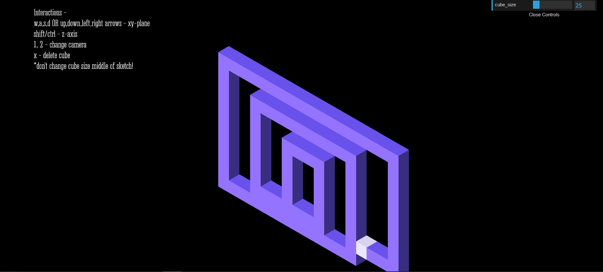
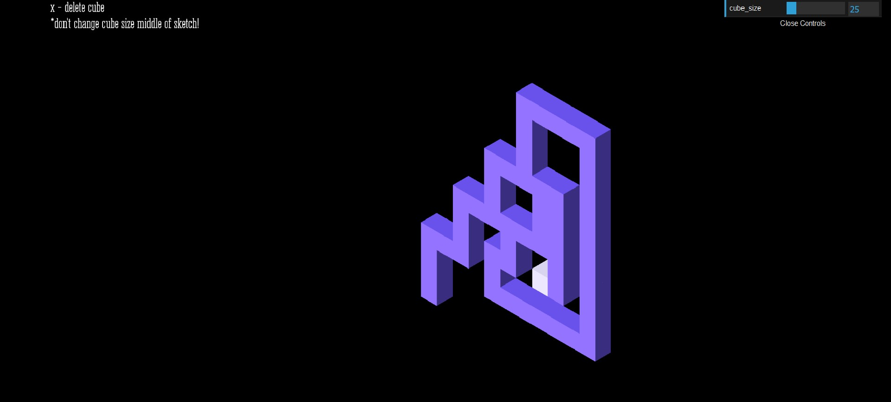
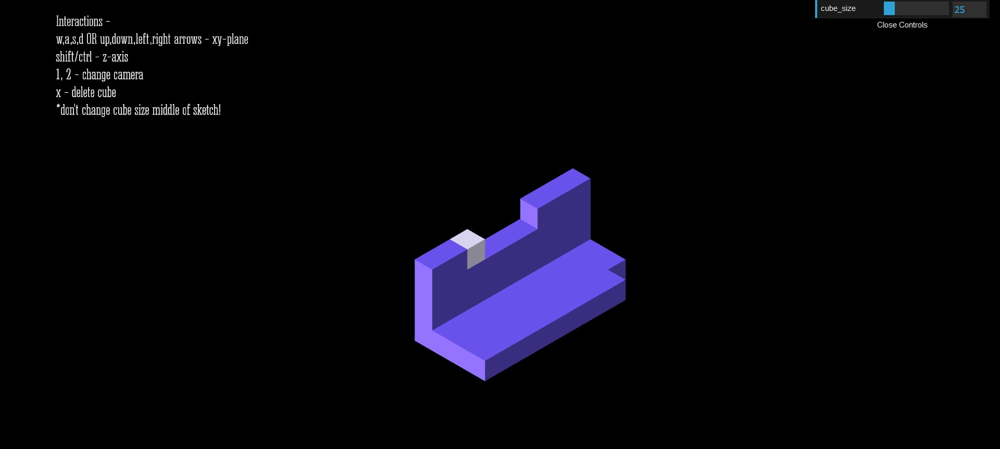
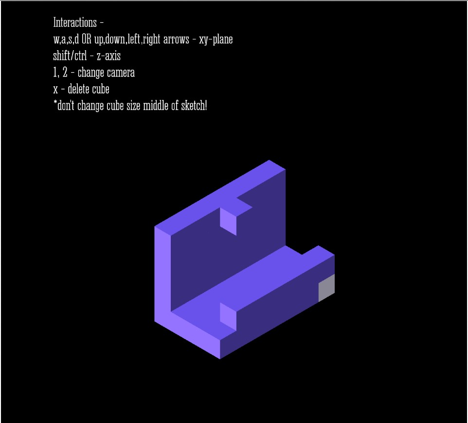

# Isometric Voxel Building/Painting Tool

[Initial Idea](https://github.com/CSVADW21/suriya/blob/master/%CE%A8Final%20Project/idea.md).  
[Progress Documentation](https://github.com/CSVADW21/suriya/blob/master/%CE%A8Final%20Project/progress.md).  
[OpenProcessing Sketch](https://openprocessing.org/sketch/1124370).

Retro style voxel-based isometric drawing tool.
Major contributions - 
1. Camera - Understanding and building an isometric camera model
2. Interactions - Built an intutive keyboard interactions
3. Brushes - Built a box-based cube class with 3D positions and shading.

### Sketches

#### Some CAD Drawings

